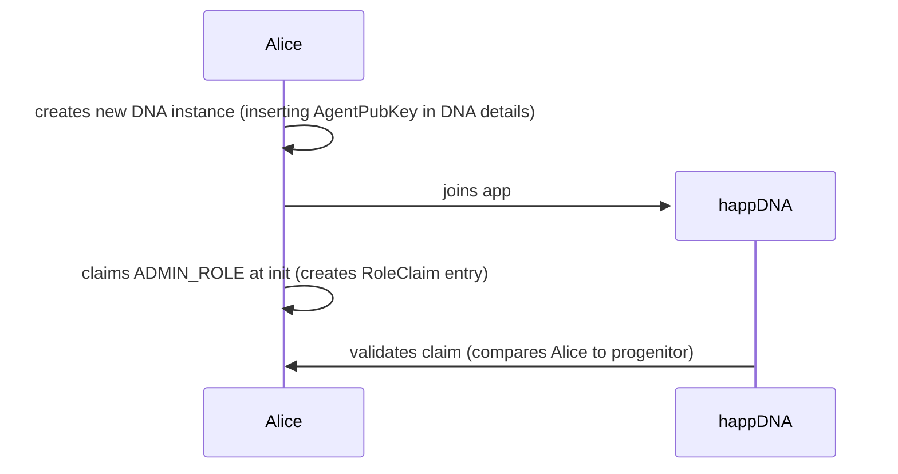
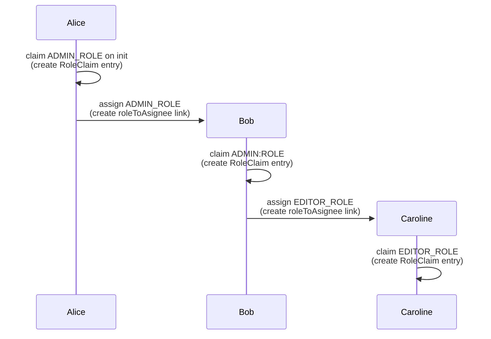

# @darksoil-studio/roles-zome

## Modularity

This module follows the [holochain-open-dev](https://github.com/holochain-open-dev/) pattern of developing holochain modules. Read [its documentation](https://holochain-open-dev.github.io) to understand more about its motivation and the big picture.

To integrate this module into your application:

- If you are starting a new project from scratch, it is very recommended to follow the [Template Setup](?path=/docs/template-setup--docs).
- If not, you can visit [Setting up the Backend](?path=/docs/backend-setting-up-the-zomes--docs) and [Setting up the Frontend](?path=/docs/frontend-setting-up-the-frontend--docs).

## Module design

Creating roles in fully peer-to-peer systems can be tricky. There is no node in the network that by default is able to administer the system. In order to introduce role based management on Holochain, someone needs to be written into the app as it is generated as the agent that has special rights, this will then be part of the rules of the app that everyone plays by (the DNA).

The pattern we are using in this module is the progenitor pattern. This means that the agent that instantiates the DNA writes themselves into the DNA as the original admin. Once an original admin is created, this administrator is able to generate further roles including additional administrators. Administrators are also able to remove all of the roles from Agents (including the Admin role of the progenitor). Below you will find graphical representations of how the module works.

**This pattern creates the requirement of a layer outside the app (like a lobby) where a user is able to create the instantiation of the app so that the public key (AgentPubKey) associated with the original user is encoded into the DNA as it is being created. Read more about this in the implementation considerations section below.**

### Original administrator (progenitor)
In order to create an initial admin for the app, we are using the progenitor pattern. This means, the creator of the app (of the DNA actually) is the one who is the original admin. More admins can be added like adding any other roles by the progenitor.

### Role assignment

In the diagram below Alice is the progenitor and is therefore granted ADMIN_ROLE when entering the DNA. 

## Design considerations
The possibility of actually using the capacities that an app developer is connecting to a role is validated by checking if the Agent has commited a claim to a role in their own source chain. The validation for creating such a claim for yourself is based on finding an assignment from an admin that allows one to create the claim. 

It is implemented in this way in order to be sure that when someone is evaluating if an action is allowed (through a role) from an Agent, that enabling role claim must be found earlier in the source chain of that Agent to become deterministic.

## Implementation considerations
It is very important to understand that if you want to use this module, the instantiator's AgentPubKey needs to be inserted into the [DNA properties](https://docs.rs/holochain_types/0.5.0-dev.0/holochain_types/prelude/struct.DnaModifiers.html#structfield.properties). This means that you need to have a running conductor that has access to an AgentPubKey that can be insterted into the app. 
